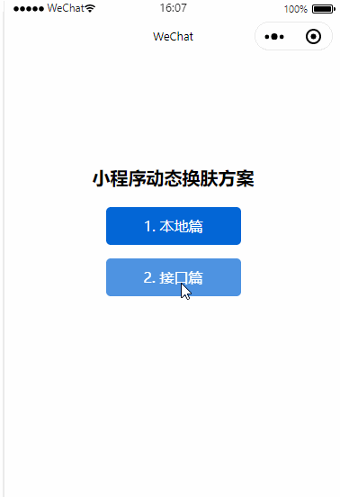

### 需求说明

上一篇文章我是先通过在小程序本地预设几种主题样式，然后改变类名的方式来实现小程序的换肤功能的;

但是产品经理觉得每次改主题配置文件，都要发版，觉得太麻烦了，于是发话了：**我想在管理后台有一个界面，可以让运营自行设置颜色，然后小程序这边根据运营在后台设置的色值来实现动态换肤，你们来帮我实现一下。**

### 方案和问题

首先我们知道小程序是不能动态引入 `wxss` 文件的，这时候的色值字段是需要从后端接口获取之后，然后通过 `style` 内联的方式动态写入到需要改变色值的页面元素的标签上;
工作量之大，可想而知，因此，我们需要思考下面几个问题，然后尽可能写出可维护性，可扩展性的代码来：

1.  **页面元素组件化** —— 像`按钮` `标签` `选项卡` `价格字体` `模态窗`等组件抽离出来，认真考虑需要换肤的页面元素，避免二次编写；

2.  **避免内联样式直接编写，提高代码可阅读性** —— 内联编写样式会导致大量的 `wxml`  和 `wxss` 代码耦合一起，可考虑采用 `wxs` 编写模板字符串，动态引入，减少耦合；

3.  **避免色值字段频繁赋值** —— 页面或者组件引入 `behaviors` 混入色值字段，减少色值赋值代码编写；

**ps: 后续我会想办法尽可能通过别的手段，来通过js结合stylus预编译语言的方式，将本地篇和接口篇两种方案结合起来，即读取接口返回的色值之后，动态改变stylus文件的预设色值变量，而不是内联的方式实现小程序动态换肤**

### 实现

接下来具体来详细详解一下我的思路和如何实现这一过程：

1. **model层：** 接口会返回色值配置信息，我创建了一个 `model` 来存储这些信息，于是，我用单例的方式创建一个全局唯一的 `model` 对象 —— `ViModel`

```javascript
// viModel.js
/**
 * 主题对象：是一个单例
 * @param {*} mainColor 主色值
 * @param {*} subColor 辅色值
 */
function ViModel(mainColor, subColor) {
  if (typeof ViModel.instance == 'object') {
    return ViModel.instance
  }

  this.mainColor = mainColor
  this.subColor = subColor
  ViModel.instance = this
  return this
}

module.exports = {
  save: function(mainColor = '', subColor = '') {
    return new ViModel(mainColor, subColor)
  },

  get: function() {
    return new ViModel()
  }
}
```

2. **service层：** 这是接口层，封装了读取主题样式的接口，比较简单，用 `setTimeout` 模拟了请求接口访问的延时，默认设置了 `500` ms，如果大家想要更清楚的观察 **observer 监听器** 的处理，可以将值调大若干倍

```javascript
// service.js
const getSkinSettings = () => {
  return new Promise((resolve, reject) => {
    // 模拟后端接口访问，暂时用500ms作为延时处理请求
    setTimeout(() => {
      const resData = {
        code: 200,
        data: {
          mainColor: '#ff9e00',
          subColor: '#454545'
        }
      }

      // 判断状态码是否为200
      if (resData.code == 200) {
        resolve(resData)
      } else {
        reject({ code: resData.code, message: '网络出错了' })
      }
    }, 500)
  })
}

module.exports = {
  getSkinSettings,
}
```

3. **view层：** 视图层，这只是一个内联css属性转化字符串的过程，我美其名曰**视图层**，正如我开篇所说的，`内联` 样式的编写会导致大量的 `wxml` 和 `wxss`代码冗余在一起，如果换肤的元素涉及到的 `css` 属性改动过多，再加上一堆的 `js` 的逻辑代码，后期维护代码必定是灾难性的，根本无法下手，大家可以看下我优化后的处理方式：

```javascript
// vi.wxs
/**
 * css属性模板字符串构造
 * 
 * color => color属性字符串赋值构造
 * background => background属性字符串赋值构造
 */
var STYLE_TEMPLATE = {
  color: function(val) {
    return 'color: ' + val + '!important;'
  },

  background: function(val) {
    return 'background: ' + val + '!important;'
  }
}

module.exports = {
  /**
   * 模板字符串方法
   * 
   * @param theme 主题样式对象
   * @param key 需要构建内联css属性
   * @param second 是否需要用到辅色
   */
  s: function(theme, key, second = false) {
    theme = theme || {}
    
    if (typeof theme === 'object') {
      var color = second ? theme.subColor : theme.mainColor
      return STYLE_TEMPLATE[key](color)
    }
  }
}
```

**注意：wxs文件的编写不能出现es6以后的语法，只能用es5及以下的语法进行编写**

4. **mixin：** 上面解决完 `wxml` 和 `wxss` 代码混合的问题之后，接下来就是 `js` 的冗余问题了；我们获取到接口的色值信息之后，还需要将其赋值到`Page` 或者 `Component` 对象中去，也就是 `this.setData({....})`的方式， 才能使得页面重新 `render`，进行换肤；</br>
微信小程序原生提供一种 `Behavior` 的属性，使我们避免反复 `setData` 操作，十分方便：

```javascript
// viBehaviors.js
const observer = require('./observer');
const viModel = require('./viModel');

module.exports = Behavior({
  data: {
    vi: null
  },

  attached() {
    // 1. 如果接口响应过长，创建监听，回调函数中读取结果进行换肤
    observer.addNotice('kNoticeVi', function(res) {
      this.setData({ vi: res })
    }.bind(this))

    // 2. 如果接口响应较快，modal有值，直接赋值，进行换肤
    var modal = viModel.get()
    if (modal.mainColor || modal.subColor) {
      this.setData({ vi: modal })
    }
  },

  detached() {
    observer.removeNotice('kNoticeVi')
  }
})
```

到这里为止，基本的功能性代码就已经完成了，接下来我们来看一下具体的使用方法吧

### 具体使用

1. 小程序启动，我们就需要去请求接口的色值配置接口，获取主题样式，如果是需要从后台返回前台的时候也要考虑主题变动，可以在 `onShow` 方法处理

```javascript
// app.js
const { getSkinSettings } = require('./js/service');
const observer = require('./js/observer');
const viModel = require('./js/viModel');

App({
  onLaunch: function () {
    // 页面启动，请求接口
    getSkinSettings().then(res => {
      // 获取色值，保存到modal对象中
      const { mainColor, subColor } = res.data
      viModel.save(mainColor, subColor)

      // 发送通知，变更色值
      observer.postNotice('kNoticeVi', res.data)
    }).catch(err => {
      console.log(err)
    })
  }
})
```

2. 页面混入主题样式字段

```javascript
// interface.js
const viBehaviors = require('../../js/viBehaviors');

Page({
  behaviors: [viBehaviors],

  onLoad() {}
})
```

3. 页面内联样式动态换肤

```html
<view class="intro">
  <view class="font mb10">正常字体</view>
  <view class="font font-vi mb10" style="{{_.s(vi, 'color')}}">vi色字体</view>
  <view class="btn main-btn mb10" style="{{_.s(vi, 'background')}}">主色按钮</view>
  <view class="btn sub-btn" style="{{_.s(vi, 'background', true)}}">辅色按钮</view>
</view>

<!-- 引入模板函数 -->
<wxs module="_" src="../../wxs/vi.wxs"></wxs>
```

再来对比一下传统的内联方式处理换肤功能的实现：

```html
<view style="color: {{ mainColor }}; background: {{ background }}">vi色字体</view>
```

如果再加入逻辑代码，对于开发人员后期阅读代码简直就是要抓狂了；这只是一定程度上简化了内联代码的编写，原理还是内联样式的注入。

### 效果预览

1. 接口响应较快 —— `ViModel` 取值换肤

  

2. 接口响应过慢 —— `observer` 监听器回调取值换肤

  

### 项目地址
项目地址：[https://github.com/csonchen/wxSkin](https://github.com/csonchen/wxSkin)

这是本文案例的项目地址，为了方便大家浏览项目，我把编译后的wxss文件也一并上传了，大家打开就能预览，码字不易，大家如果觉得好，希望大家都去点下star哈，谢谢大家。。。