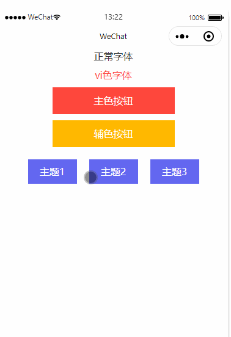

## 小程序动态换肤方案 -- 本地篇

### 需求说明

在开发小程序的时候，尤其是开发第三方小程序，我们作为开发者，只需要开发一套模板，客户的小程序对我们进行授权管理，我们需要将这套模板应用到对方的小程序上，然后进行发版审核即可；

但是个别客户的小程序需要做 `定制化配色方案`，也就是说，不同的小程序个体需要对页面的元素（比如：按钮，字体等）进行不同的配色设置，接下来我们来讨论一下怎么实现它。

### 方案和问题

一般来说，有两种解决方案可以解决小程序动态换肤的需求：

1. 小程序内置几种主题样式，通过更换类名来实现动态改变小程序页面的元素色值；

2. 后端接口返回色值字段，前端通过 `内联` 方式对页面元素进行色值设置。

当然了，每种方案都有一些问题，问题如下：

 - 方案1较为死板，每次更改主题样式都需要发版小程序，如果主题样式变动不大，可以考虑这种；

 - 方案2对于前端的改动很大，`内联` 也就是通过 `style` 的方式内嵌到`wxml` 代码中，代码的阅读性会变差，但是可以解决主题样式变动不用发版小程序的问题。 

**ps：我一直在尝试如何在小程序里面，通过js动态修改stylus的比变量问题，这样就可以解决上面说的问题了，后期如果实现了，一定周知各位**

本文先重点描述第一种方案的实现，文章末尾会贴上我的 `github项目` 地址，方便大家尝试。

### 前期准备

本文采用的是 `gulp` + `stylus` 引入预编译语言来处理样式文件，大家需要全局安装一下 `gulp`，然后安装两个 `gulp` 的插件 
  1. `gulp-stylus`（stylus文件转化为css文件）
  2. `gulp-rename`（css文件重命名为wxss文件）。

#### gulp

这里简单贴一下gulpfile文件的配置，比较简单，其实就是借助 `gulp-stylus` 插件将 `.styl` 结尾的文件转化为 `.css` 文件，然后引入 `gulp-rename` 插件对文件重命名为 `.wxss` 文件；

再创建一个任务对 `.styl` 监听修改，配置文件如下所示：
 
```javascript
var gulp = require('gulp');
var stylus = require('gulp-stylus');
var rename = require('gulp-rename');

function stylusTask() {
  return gulp.src('./styl/*.styl')
             .pipe(stylus())
             .pipe(rename(function(path) {
               path.extname = '.wxss'
             }))
             .pipe(gulp.dest('./wxss'))
}

function autosTask() {
  gulp.watch('./styl/*.styl', stylusTask)
}

exports.default = gulp.series(gulp.parallel(stylusTask, autosTask))
```

#### stylus

这里会分为两个文件，一个是主题样式变量定义文件，一个是页面皮肤样式文件，依次如下所示：

1. 主题样式变量设置

```stylus
// theme1
theme1-main = rgb(254, 71, 60)
theme1-sub = rgb(255, 184, 0) 

// theme2
theme2-main = rgb(255, 158, 0)
theme2-sub = rgb(69, 69, 69)

// theme3 
theme3-main = rgb(215, 183, 130)
theme3-sub = rgb(207, 197, 174)
```

2. 页面皮肤样式

```stylus
@import './define.styl'

// 拼接主色值
joinMainName(num) 
  theme + num + -main

// 拼接辅色值
joinSubName(num)
  theme + num + -sub  

// 遍历输出改变色值的元素类名
for num in (1..3)
  .theme{num}
    .font-vi
      color joinMainName(num)

    .main-btn
      background joinMainName(num)
      
    .sub-btn
      background joinSubName(num)   
```

输出：

```css
.theme1 .font-vi {
  color: #fe473c;
}
.theme1 .main-btn {
  background: #fe473c;
}
.theme1 .sub-btn {
  background: #ffb800;
}
.theme2 .font-vi {
  color: #ff9e00;
}
.theme2 .main-btn {
  background: #ff9e00;
}
.theme2 .sub-btn {
  background: #454545;
}
.theme3 .font-vi {
  color: #d7b782;
}
.theme3 .main-btn {
  background: #d7b782;
}
.theme3 .sub-btn {
  background: #cfc5ae;
}
```

代码我写上了注释，我还是简单说明一下上面的代码：我首先定义一个主题文件 `define.styl` 用来存储色值变量，然后会再定义一个皮肤文件 `vi.styl` ，这里其实就是不同 `主题类名` 下需要改变色值的元素的属性定义，元素的色值需要用到 `define.styl` 预先定义好的变量，是不是很简单，哈哈哈。

### 具体使用

但是在具体页面中需要怎么使用呢，接下来我们来讲解一下

1. 页面的 `wxss` 文件导入编译后的 `vi.wxss`文件

```css
@import '/wxss/vi.wxss';
```
2. 页面的 `wxml` 文件需要编写需要改变色值的元素，并且引入变量 `theme`

```html
<view class="intro {{ theme }}">
  <view class="font mb10">正常字体</view>
  <view class="font font-vi mb10">vi色字体</view>
  <view class="btn main-btn mb10">主色按钮</view>
  <view class="btn sub-btn">辅色按钮</view>
</view>
```
3. 页面 `js` 文件动态改变 `theme`变量值
```javascript
  data: {
    theme: ''
  },

  handleChange(e) {
    const { theme } = e.target.dataset
    this.setData({ theme })
  }
```

### 效果展示


### 项目地址

项目地址：[https://github.com/csonchen/wxSkin](https://github.com/csonchen/wxSkin)

这是本文案例的项目地址，为了方便大家浏览项目，我把编译后的wxss文件也一并上传了，大家打开就能预览，如果觉得好，希望大家都去点下star哈，谢谢大家。。。