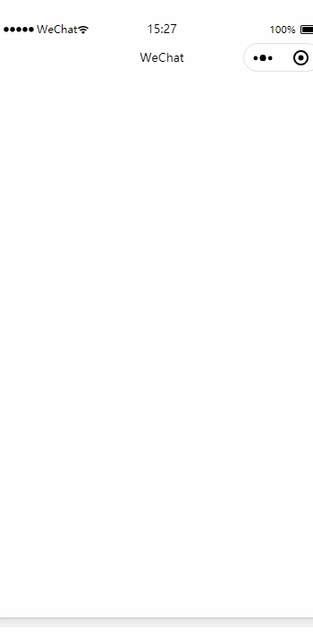

## 小程序动态换肤解决方案 -- 终极篇

### 回顾

早些日子，我写过两篇文章介绍过在微信小程序内，如何实现换肤功能，下面贴出链接，没看过的同学可以先看看

1. [小程序动态换肤解决方案 -- 本地篇](https://developers.weixin.qq.com/community/develop/article/doc/0008e250998df0dee23aaec5e51813)

2. [小程序动态换肤解决方案 -- 接口篇](https://developers.weixin.qq.com/community/develop/article/doc/0006827755039085ff3a5cf0b50813)

但是上面两种方案都有不足之处，所以我在文末也备注了会出 **终极篇解决方案**，拖延了一些时间，今天看到评论区有人cue我说什么时候出终极篇，于是，今天花了写时间整理了一下，希望可以帮助到大家。

### 方案

其实这篇文章提供的解决方案，更多是 `接口篇`的优化版本。

解决思路就是：

将接口获取到的皮肤色值属性，动态设置到需要换肤的元素的某个属性上，本质上就是替换元素的css属性的属性值，方法就是通过给当前`Page`和`Component`对象的`js文件`嵌入提前设置好的`css变量`中，然后通过`setData`的方法回显到对应的`wxml文件`中。

1. 采用 **css变量** 的方式替代原有 **内联修改样式** 的方式;

2. 采用小程序原生提供的mixin解决方案 —— `Behavior`，对页面还有组件对象来说，虽有一定的侵害性，但是可以极大程度的降低重复代码的编写；

### 代码

**1. 监听器模块**

我们知道，接口返回的数据是异步的，所以，当我们进入到指定的 `Page`和`Component` 对象内部的时候，有可能还没得到数据，就需要先注册一个监听函数，等到皮肤接口请求成功之后，然后再执行皮肤设值操作；


```js
// observer.js

function Observer() {
  this.actions = new Map()
}

// 监听事件
Observer.prototype.addNotice = function(key, action) {
  // 因为同个Page（页面）或者Component（组件）对象有可能引入多个组件
  // 这些组件都用到了同一个监听器，每个监听器的回调函数需要单独处理
  // 因此，结果就是： key => [handler1, hander2, hander3....]
  if (this.actions.has(key)) {
    const handlers = this.actions.get(key)
    this.actions.set(key, [...handlers, action])
  } else {
    this.actions.set(key, [action])
  }
}

// 删除监听事件
Observer.prototype.removeNotice = function(key) {
  this.actions.delete(key)
}

// 发送事件
Observer.prototype.postNotice = function(key, params) {
  if (this.actions.has(key)) {
    const handlers = this.actions.get(key)
    // 皮肤接口获取数据成功，取出监听器处理函数，依次执行
    handlers.forEach(handler => handler(params))
  }
}


module.exports = new Observer()
```

**2. 皮肤对象模型模块**

因为皮肤接口只会在程序首次加载运行的时候执行，换言之，通过 `发布-订阅` 的方式来设置皮肤只会`发生在第一次接口请求成功之后`，后期都不会再执行；因此，我们需要通过一个Model模型对象将数据存储起来，后面的皮肤设值操作都从该model对象中获取；

```js
// viModel.js

/**
 * @param {*} mainColor 主色值
 * @param {*} subColor 辅色值
 * @param {*} reset 重置
 */

function ViModel(mainColor, subColor, reset = false) {
  // 如果当前实例已经设置过，直接返回该实例
  if (typeof ViModel.instance == 'object' && !reset) {
    return ViModel.instance
  }

  this.mainColor = mainColor
  this.subColor = subColor
  // 实例赋值动作触发在接口有数据返回的时候
  if (this.mainColor || this.subColor) {
    ViModel.instance = this
  }
  return this
}

module.exports = {
  // 通过save方法来赋值要通过reset = true来重置对象
  save: function(mainColor = '', subColor = '') {
    return new ViModel(mainColor, subColor, true)
  },

  // 直接返回的都是已经有值的单例实例
  get: function() {
    return new ViModel()
  }
}
```

**3. 小程序Mixin模块 —— Behavior**

**这个就是这次分享的最为重要的模块 —— 注入 themeStyle 的css变量**

我们直接来看这段代码:

```js
setThemeStyle({ mainColor, subColor }) {
  this.setData({
    themeStyle: `
      --main-color: ${mainColor};
      --sub-color: ${subColor};
    `
  })
}
```

想必看到这里，大家应该猜到开篇说的实现原理了

这里的 `themeStyle` 就是我们接下来要注入到 `Page` 和 `Component` 的 data 属性，也就是需要在页面和组件中设置的`动态css变量属性`

```js
//skinBehavior.js

const observer = require('./observer');
const viModel = require('./viModel');


module.exports = Behavior({
  data: {
    themeStyle: null
  },

  attached() {
    // 1. 如果接口响应过长，创建监听，回调函数中读取结果进行换肤
    observer.addNotice('kNoticeVi', function(res) {
      this.setThemeStyle(res)
    }.bind(this))

    // 2. 如果接口响应较快，modal有值，直接赋值，进行换肤
    const themeData = viModel.get()
    if (themeData.mainColor || themeData.subColor) {
      this.setThemeStyle(themeData)
    }
  },

  detached() {
    observer.removeNotice('kNoticeVi')
  },

  methods: {
    setThemeStyle({ mainColor, subColor }) {
      this.setData({
        themeStyle: `
          --main-color: ${mainColor};
          --sub-color: ${subColor};
        `
      })
    },
  },
})
```

**4. 【应用】—— Component模块**

- js 文件引入`skinBehavior.js`，通过`Component对象`提供的`behaviors`属性注入进去;

- wxml 文件根节点设置`style="{{themeStyle}}"`，设置css变量值；

- wxss 文件通过css变量设置皮肤色值 `background: var(--main-color, #0366d6);`

```js
// wxButton2.js

const skinBehavior = require('../../js/skinBehavior');

Component({
  behaviors: [skinBehavior],

  properties: {
    // 按钮文本
    btnText: {
      type: String,
      value: ''
    },

    // 是否为辅助按钮，更换辅色皮肤
    secondary: {
      type: Boolean,
      value: false
    }
  }
})
```

```xml
<!-- wxButton2.wxml -->

<view class="btn-default btn {{secondary ? 'btn-secondary' : ''}}" style="{{themeStyle}}">{{ btnText }}</view>
```

```css
/* wxButton2.wxss */
.btn {
  width: 200px;
  height: 44px;
  line-height: 44px;
  text-align: center;
  color: #fff;
}

.btn.btn-default {
  background: var(--main-color, #0366d6);
}

.btn.btn-secondary {
  background: var(--sub-color, #0366d6);
}
```

**5. 【应用】 —— Page模块**

使用方法跟Component模块一样，就不写了，下面贴一下代码：

```js
// skin.js
const skinBehavior = require('../../js/skinBehavior');

Page({
  behaviors: [skinBehavior],

  onLoad() {
    console.log(this.data)
  }
})
```
```xml
<!--skin.wxml-->
<view class="page" style="{{themeStyle}}">
  换肤终极篇

  <view class="body">
    <wxButton2 class="skinBtn" btnText="按钮1"></wxButton2>
    <wxButton2 class="skinBtn"btnText="按钮2" secondary></wxButton2>
    <wxButton2 class="skinBtn" btnText="按钮2" ></wxButton2>
  </view>
</view>
```
```css
/* skin.wxss */
.page {
  padding: 20px;
  color: var(--main-color);
}

.skinBtn {
  margin-top: 10px;
  float: left;
}
```

**6. 【初始化】—— 接口调用**

这里就是在小程序的启动文件 app.js 调用皮肤请求接口，初始化皮肤

```js
// app.js
const { getSkinSettings } = require('./js/service');

App({
  onLaunch: function () {
    // 页面启动，请求接口
    getSkinSettings().catch(err => {
      console.log(err)
    })
  }
})

```

### 效果展示




### 项目地址

项目地址：[https://github.com/csonchen/wxSkin](https://github.com/csonchen/wxSkin)

这是本文案例的项目地址，如果觉得好，希望大家都去点下star哈，谢谢大家。。。